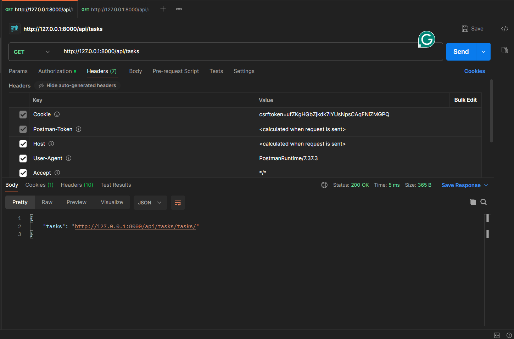

# 🚀 Task Management System

A high-performance **Task Management System** built with **Django REST Framework**, **Celery**, **Redis**, **PostgreSQL**, **Django Channels**, and **Docker**. 
In this I worked on following features . To use Redis you need to use WSL or Linux .

## 🌟 Features
- ✅ **User Authentication** (JWT-based authentication)
- ✅ **Task Management** (Create, Assign, Update, Delete)
- ✅ **Multi-threaded Report Generation** (Handles 100,000+ tasks efficiently)
- ✅ **Real-Time Task Updates** (Django Channels & WebSockets)
- ✅ **Asynchronous Notifications** (Celery + Redis)
- ✅ **Caching for Performance** (Redis)
- ✅ **Fully Dockerized Deployment**

## 🚀 Tech Stack
- ✅ **Backend: Django, Django REST Framework (DRF)**
- ✅ **Database: PostgreSQL**
- ✅ **Asynchronous Tasks: Celery, Redis**
- ✅ **Deployment: Docker, Gunicorn**
- ✅ **Authentication: JWT (JSON Web Token)**


## ⚙️ Installation & Setup

### **1️⃣ Clone the Repository**
```bash
git clone https://github.com/your-username/task-management.git
cd task-management
```

### **2 Install Requirements**
```bash
pip install -r requirements.txt
```
### **3 Apply Migrations**
```bash
python manage.py migrate
python manage.py createsuperuser
```

### **4 Run Server**
```bash
python manage.py runserver
```

### **5 Install Redis on WSL**
```bash
curl -fsSL https://packages.redis.io/gpg | sudo gpg --dearmor -o /usr/share/keyrings/redis-archive-keyring.gpg
sudo chmod 644 /usr/share/keyrings/redis-archive-keyring.gpg
echo "deb [signed-by=/usr/share/keyrings/redis-archive-keyring.gpg] https://packages.redis.io/deb $(lsb_release -cs) main" | sudo tee /etc/apt/sources.list.d/redis.list
sudo apt-get update
sudo apt-get install redis
```
### **6 Install Celery**

```bash
pip install celery
pip install django
# or
pip install celery django-celery

```

- Open postman Api collection tool http://localhost:8080/api/tasks
     
- Celery Logs
      
- Redis Logs
      

